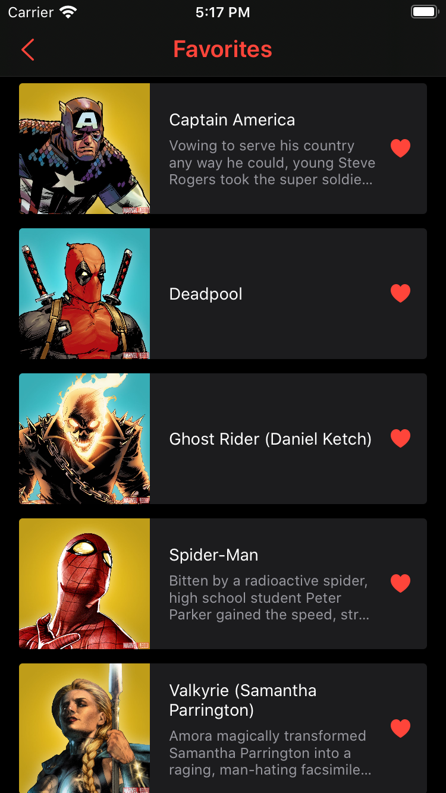
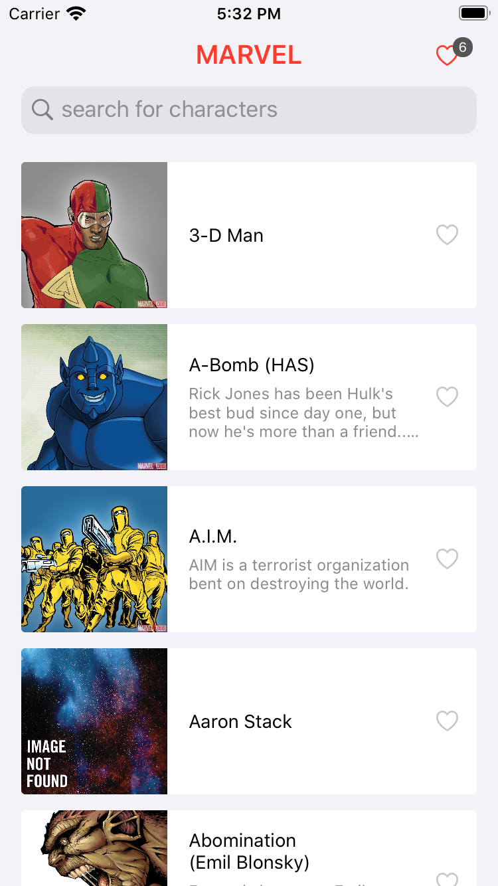

 


# Marvel Characters

Este projeto foi desenvolvido em Swift com UIKit e tem como objetivo apresentar a lista de personagens da Marvel em um app para iOS.

## Light e Dark Mode
O app é adaptável ao tema do sistema operacional.

 

## Funcionalidades
- Lista de personagens
- Detalhe do personagem
- Pesquisa de personagem
- Lista de favoritos

   

### Menu
-  [Começando](#começando)
	-  [Pré-requisito](#pré-requisito)
-  [Guia de instalação](#guia-de-instalação)
	-  [Xcode](#xcode)
	-  [Homebrew](#homebrew)
	    - [SwiftGen](#swiftgen)
	    - [SwiftLint](#swiftlint)
    -  [CocoaPods](#cocoapods)
-  [Clonando o repositório](#clonando-o-repositório)
-  [Testes](#testes)
-  [Bibliotecas utilizadas](#bibliotescas-utilizadas)

## Começando
As instruções a seguir irão fornecer a você uma cópia do projeto e possibilitar a execução do mesmo em seu computador.

### Pré-requisito
- Computador com macOS Ventura 13 ou superior

## Guia de instalação
Instale as ferramentas abaixo para poder executar o app no Xcode.

### Xcode
Baixe o Xcode na [App Store](https://apps.apple.com/br/app/xcode/id497799835).

### Homebrew
Siga as instruções de instalação no site [brew](https://brew.sh/index_pt-br) ou execute o comando abaixo no terminal do Mac:
```
/bin/bash -c "$(curl -fsSL https://raw.githubusercontent.com/Homebrew/install/master/install.sh)"
```

> Nota: Para Mac com processador **Apple Silicon**, será necessário executar o comando abaixo no terminal.
> 1. echo 'eval "$(/opt/homebrew/bin/brew shellenv)"' >> /Users/<span style="color: red">SEU USUÁRIO</span>/.zprofile


### SwiftGen
No **terminal** execute:
```
brew install swiftgen
```

### SwiftLint
No **terminal** execute:
```
brew install swiftlint
```

### CocoaPods
No **terminal** execute:
```
sudo gem install cocoapods
```

> Nota: Para Mac com processador **Apple Silicon**, será necessário executar os comandos abaixo.
> 1. sudo arch -x86_64 gem install ffi
> 2. arch -x86_64 pod install

## Clonando o repositório
No **terminal**, abra o diretório de sua preferência e execute a linha de comando abaixo para clonar o repositório.
```
git clone https://github.com/alexbarbosabr/MarvelCharacters.git
```

Ao fim do clone, abra a pasta raiz do projeto no terminal e execute o comando:
```
pod install
```

Após instalação dos Pods, abra o arquivo **.xcworkspace** localizado na pasta raiz do projeto.

# Informações complementares

## Testes
O projeto possui testes automátizados nos targets MarvelCharactersTests e MarvelCharactersUITests.
Para os testes de snapshot do MarvelCharactersTests foi utilizado o simulador do **iPhone SE (3nd generation)** com **iOS 16.4**. Outros simuladores com a mesma proporção de tela podem funcionar.

## Bibliotecas utilizadas
Instalação via CocoaPods:
- Nimble-Snapshots  (Testes de UI)
- KIF  (Testes instrumentados e funcionais)
- KIF/IdentifierTests  (Testes instrumentados e funcionais)

Instalação via Swift Package Manager:
- Kingfisher  (Download de imagens)